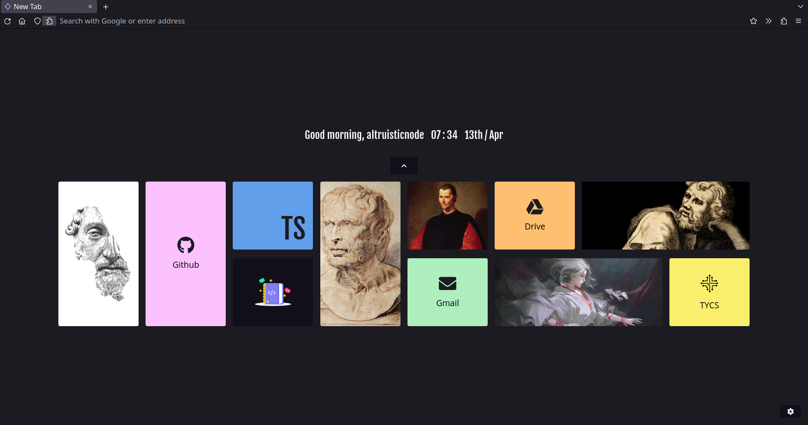
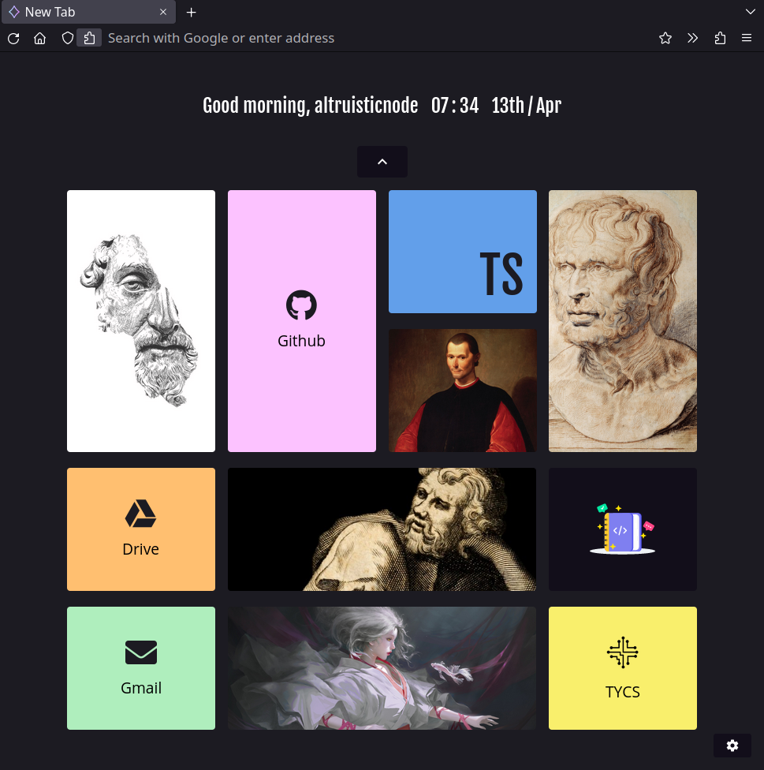

    </img>

<h3 align="center">Atomic Fox</h3>

  
  

## Table of Contents
- [About the Project](#about-the-project)
  * [Description](#description)
- [Getting Started](#getting-started)
  * [Firefox CSS](#firefox-css)
  * [Night Tab Configuration](#night-tab-configuration)
- [Preview](#preview)

## About 
### Description 
This project includes an extremely minimalistic and light `chrome` modification of the [Firefox](https://en.wikipedia.org/wiki/Firefox) browser client.

As an addition, this also includes an optional configuration set for the [Night Tab](https://addons.mozilla.org/en-US/firefox/addon/nighttab/) start-up page extension.

As the name *atomic* implies, this is a very minimal configuration. You can view all of the stylesheet overrides in the [chrome](/chrome/) directory.

## Preview 
All previews can be found in the [preview](/preview/) directory. It includes a wide preview, a block preview, and a preview with depth perspective.

<h4 align="center">Block Style Preview (From Window Manager)</h4>

    </img>

